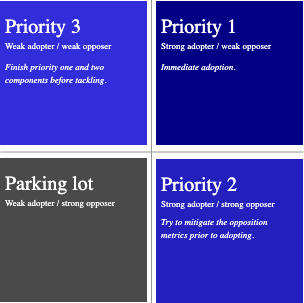

# Introduction to Design Systems

- We don't develop websites in full pages anymore.
- When we associate websites with pages, we neglect the concept of re-usability
- We are in a transitional period where developers are thinking in and developing **components**.
    - Components allowed developers to maintain consistent UI's which are accessible by nature and design systems are the way to we can create these sets of reusable patterns and components.
- Design systems allow us to create a cohesive experience throughout every leg of a user's journey

## What is a design system?

- There is no industry standard definition for a design system, which can make things confusing
- Designers refer to a design system as the design language and UI kit and developers tend to think of a component library or style guide
- However, *a design system encompasses all of these things: design language, UI kit, component library and style guide*

## Why design systems matter?

- Accessibility
    - Help ensure application is accessible to all
    - i.e. Color palette with sufficient contrast ratios, typography scale, easy-to-digest content.
- Consistency
    - DS facility consistency with components throughout brand products
    - i.e. Google Suite
- Trickle-down updates
    - Huge benefit: updating a component will update all of the components being used in the product/app.
- Reponsiveness
    - Design systems are built to account for responsiveness of all devices.
- Onboarding
    - A well-documented design system ensures that new team members can be onboarded efficiently and quickly.
    - Also, DS facilitate better cross-squad collaborations
- Flexibility
    - A design system must server a variety of use cases, while setting parameters on what exactly those use cases can be
- Speed
    - Once DS has been established, time to production is greatly reduced

## Drawbacks of Design Systems

- Time
    - Design Systems take time to build. A robust DS built from the ground up can be a very long project
- Evolution
    - A design system is never complete. It isnt a project with a finite end date; its a product serving products and will evolve
- Maintenance
    - A design system is living, breathing product which has lifecycles and requires maintenance. Cannot be built without a team (unless it's your own DS)
- Investment
    - Requires designers, engineers, and product managers to ensure success
    - Number one reason design systems fail is lack of adoption

## Team Structures

1. Centralized Model
    - Dedicated Team for running and maintaining the design system.
    - Define foundation and identity of system, have veto power of system, and manage and create the UI Kit, component library and style guide
2. Distributed Model
    - No centralized core team
    - Built and maintained by consuming team (teams that use the DS)
3. Hybrid Model
    - Combines Centralized and Distributed team

## Who are design systems for?

- Design systems are meant for internal consumption
- Open source design systems are meant to share knowledge and best practices

## Three Pillars of Design System

1. Design Language
    - Comprised of two areas:
        1. Foundation
            - Color, Typography, Grid, Spacing, Iconography, Illustrations, Motion
        2. Components/UI Kit
            - Buttons, Text Fields, Modals, Dropdowns, Navigations, Footer
2. Component Library
    - A set of components which turn the design language and UI Kit into code
    - Can be built with different frameworks and libraries
    - Native web components are also a great example when thinking about building a component library
3. Style Guide
    - This is documentation for the design language, UI Kit, and component library
    - There are many ways to build a style guide (i.e. publishing Storybook site or fully-fledged website)

    ## Building a Design System

    1. Define your design principles
        - Design principles are the grounding values which drive the creation of your products
        - What do you want your users to feel when using your product?
    2. Conduct a UI audit
        - Compile all components, in every variation and state, in one place
        - Group these components by functionality
        - Prioritize the components which have the highest impact on unification of your products and are easily achievable
            - *Prioritizing Components*
                - Does this request embody our design principles?
                - Does this requires require a lot of design/development effort?
                - Does this request come with a high risk to the success of our product?
                - Does this request coincide with our product roadmap?
                - Does this request require a lot of maintenance?
                - Does this request improve the user experience of our products?
                - Are we confident in this request or will it need to be revisited again in the near future?
                - Is this request technically feasible?
            - Take these questions and turn them into impact statements. These impact statements will coincide with one of six metrics and we can do this by creating impact statements with regards to three adoption metrics and three opposition metrics
                - Adoption metrics: impact, identity, and confidence
                - Opposition metrics: maintenance, risk, and effort
                - In order to determine whether to incorporate change or component, must evaluate the benefits of employing the change against the negatives
                - Calculate Priority by survey from team and average the responses from adoption metrics and opposition metrics and turn them into x and y coordinates
                - Following four-quadrant graph depicts results of the calculating priority (x, y)  as (adopter, opposer)

                

    3. Create your checklists
        - Design Checklist
            - Accessibility
                - Can all users, regardless of circumstance, use this component
            - Interaction
                - How should component respond when user interacts with it
            - Context
                - How and where should this component be use
            - Completion
                - Are all states, including neutral, hover, focus, and disabled, defined?
            - Content
                - What type of content does this component rely upon?
            - Customization
                - Are aspects of this component customizable? If so, how?
            - Screen Resolution
                - How does this component look on varying screen resolutions?
        - Development Checklist
            - Accessibility
                - In addition to an accessible color palette, we must develop our components with semantic HTML elements in order to ensure compliance with assistive technologies. We almost must account for keyboard navigation
            - Responsiveness
                - Our components must respond to browser window resizing and varying screen resolutions
            - Completion
                - Does this component account for all aspects of the design? Have we implemented a near pixel-perfect component
            - Customization
                - Have we implemented all of the customizable aspects of this component?
            - Error Handling / Prop Validation
                - How do our components respond when something breaks? Have we incorporated type checking with React Prop Types or TypeScript to ensure our parameters comply with expected data types?
            - Browser Compatibility
                - Do the technologies we use work across all supported browsers or must we include polyfills?
    4. Define your workflows

    ## Common mistakes

    - Starting for scale
        - Only scale when needed
    - Educating before building
        - Educating your teams about your design system can negatively impact your rapport if there's nothing to use
    - Not discussing workflow
        - If you're collaborating on a design system, it's important to come to terms on a working model
    - Not Documenting Decisions
        - Design systems require a lot of investment and will often have lots of eyes on them. Documenting decisions will save you and your team the headache of having to explain to each stakeholder why you're doing something a certain way.

---